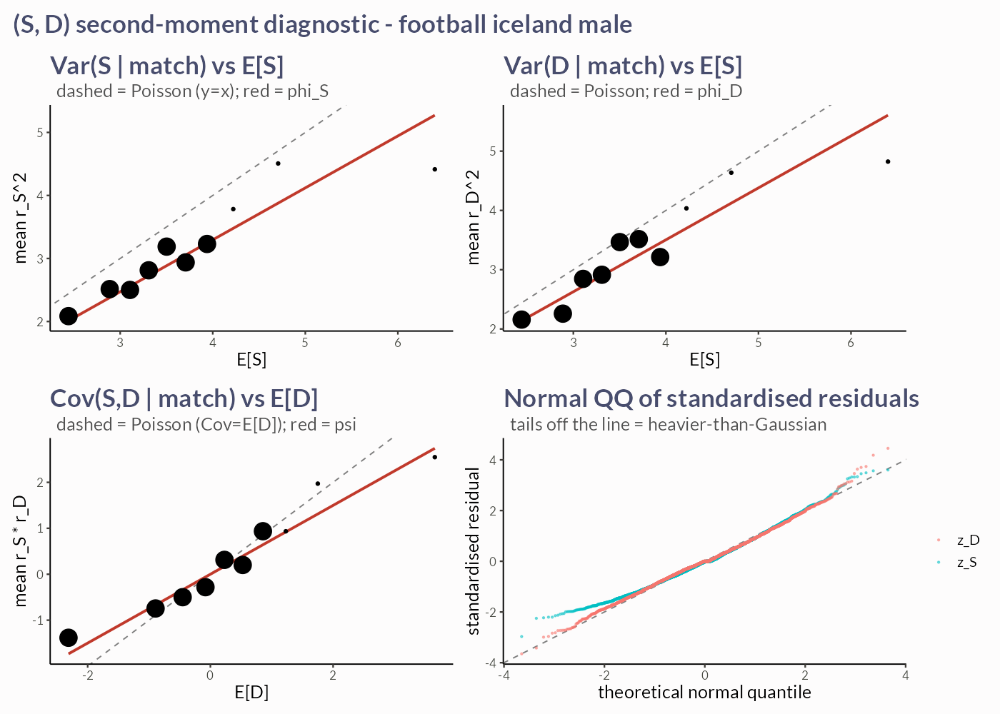
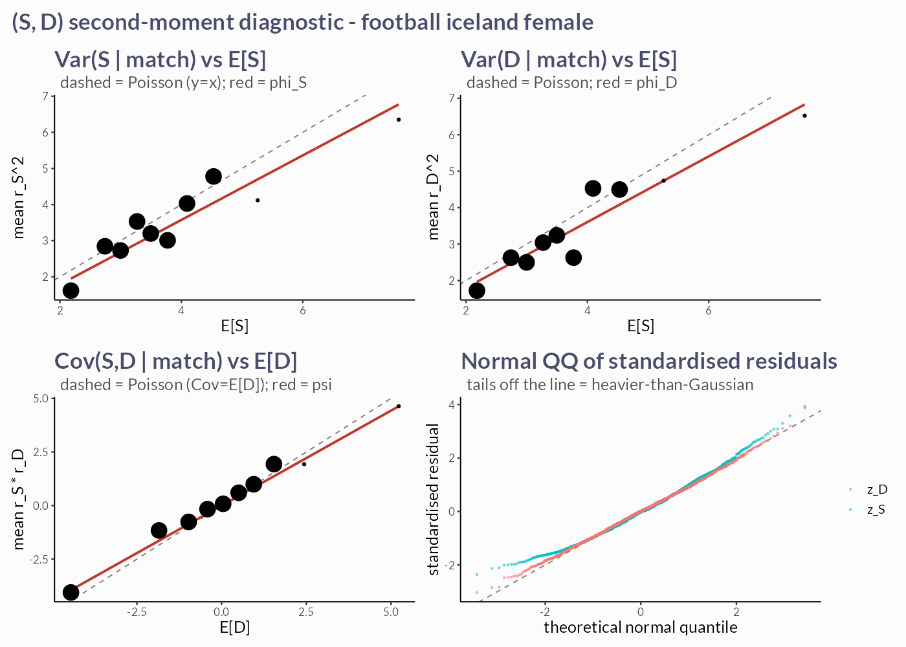

```{r setup}
suppressPackageStartupMessages({
  devtools::load_all(here::here(), quiet = TRUE)
  library(dplyr)
  library(arrow)
  library(ggplot2)
})
wf_dir <- here::here("data", "backtest", "walkforward")

load_bets <- function(model) {
  out <- list()
  for (sex in c("male", "female")) {
    f <- file.path(wf_dir, paste0("bets_", model, "_", sex, ".parquet"))
    if (!file.exists(f)) next
    b <- read_parquet(f)
    if (nrow(b) == 0L) next
    b$sport <- "football"
    b$country <- "iceland"
    b$sex <- sex
    b$model <- model
    out[[sex]] <- b
  }
  if (length(out) == 0L) tibble::tibble() else bind_rows(out)
}

bets <- bind_rows(load_bets("bvp"), load_bets("sd"))
have_data <- nrow(bets) > 0L
```

```{r}
#| eval: !expr have_data
skill <- bets |>
  group_by(model) |>
  group_modify(~ {
    sc <- bt_devig(.x)
    if (nrow(sc) == 0L) {
      return(tibble::tibble())
    }
    s <- bt_skill(sc, by = "market")
    ci <- bt_skill_ci(sc, by = "market")
    left_join(s, ci, by = "market")
  }) |>
  ungroup()
knitr::kable(skill,
  digits = 4,
  caption = "Model-vs-market skill by market (brier_skill > 0 beats the de-vigged line; skill_lo/hi = match-clustered 90% CI)"
)
```

```{r}
#| eval: !expr have_data
#| fig-width: 9
#| fig-height: 5
plt <- skill |>
  filter(!is.na(brier_skill)) |>
  ggplot(aes(market, brier_skill, fill = model)) +
  geom_col(position = position_dodge(width = 0.7), width = 0.6) +
  geom_errorbar(aes(ymin = skill_lo, ymax = skill_hi),
    position = position_dodge(width = 0.7), width = 0.2
  ) +
  geom_hline(yintercept = 0, linetype = 2) +
  labs(
    title = "OOS Brier skill vs the de-vigged Lengjan line, 2026",
    subtitle = "above 0 = beats the market; bars are 90% match-clustered CIs",
    x = NULL, y = "Brier skill (1 - model/market)"
  )
tryCatch(plt + metill::theme_metill(), error = function(e) plt + theme_minimal())
```

```{r}
#| eval: !expr (!have_data)
cat(
  "No walk-forward outputs found in", wf_dir,
  "\nRun Task 4 (scripts/0Nb_walkforward.R --model {bvp,sd} ...) first."
)
```

## Second-moment diagnostic (covariance data-story)

Regenerate with `Rscript docs/reports/2026-sd-gaussian-backtest/diagnostic.R`.




